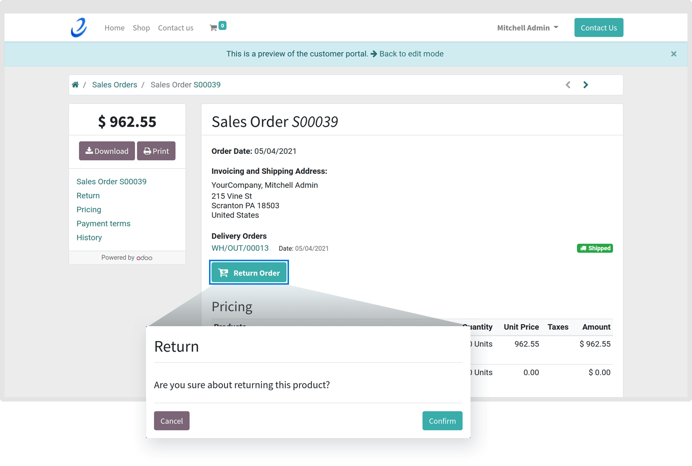
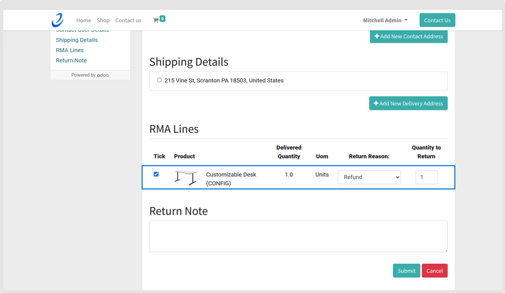
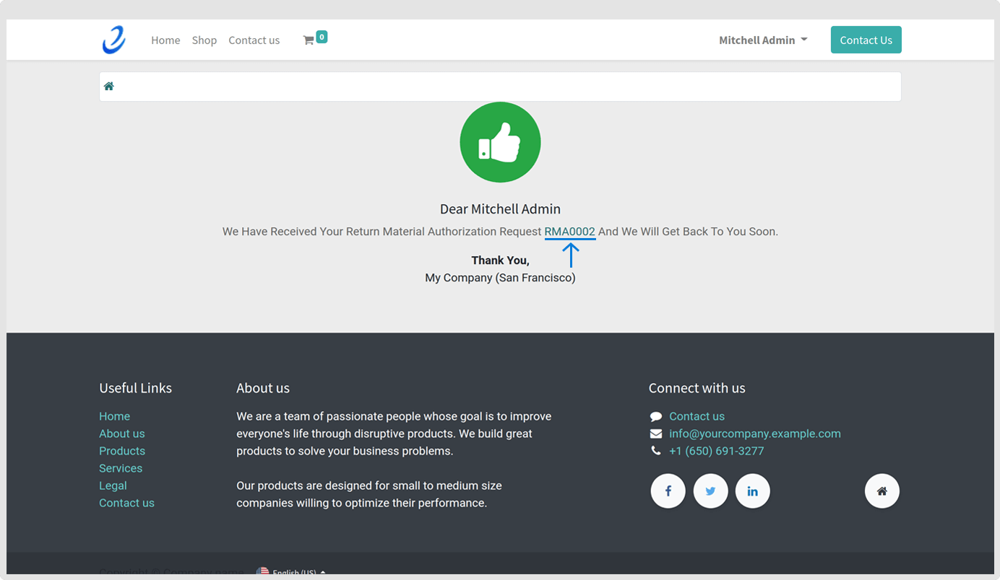

### Create Return Request from Odoo Website

After successful installation of Website RMA, a ‘Return Order’ button will appear on the sales order portal for the products which are successfully shipped to the customer.

By default, it is not provided in the eCommerce/Website App in Odoo.

When a customer clicks on that button, a confirmation dialogue box will pop-out.

 

 

When the **Confirm** button is clicked, an RMA request form of the particular sales order will appear for a customer in which all the product details bought by the customer will be shown. Here, a customer can select Return Reason, enter the number of Quantity to Return and can write Return Note if there is any.

 

 

 

 

After entering all the details, a **Submit** is clicked and a confirmation message will be displayed to the customer with RMA number. This RMA number is used to track the RMA request by the customer.

 

 

