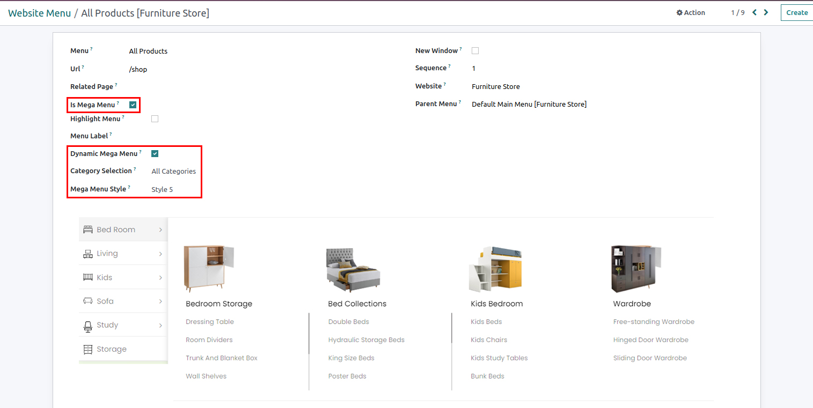
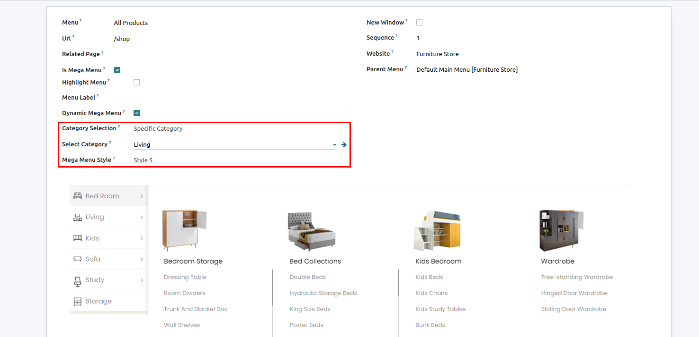
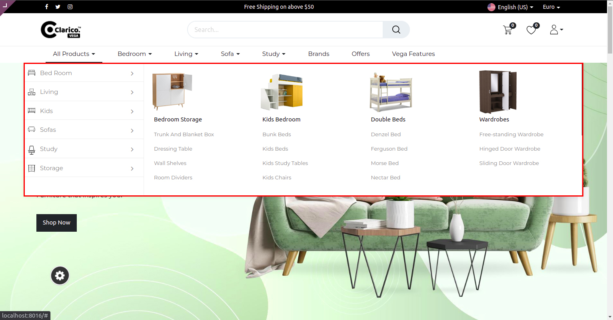
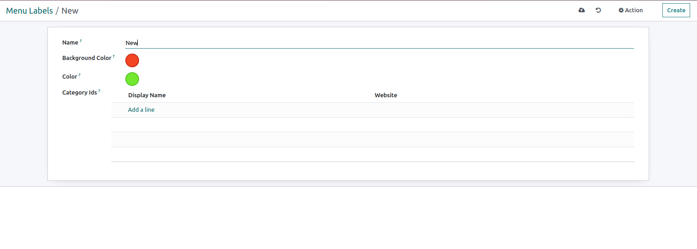
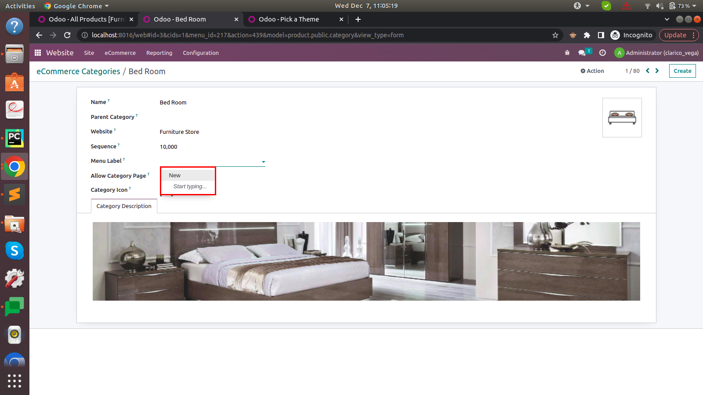
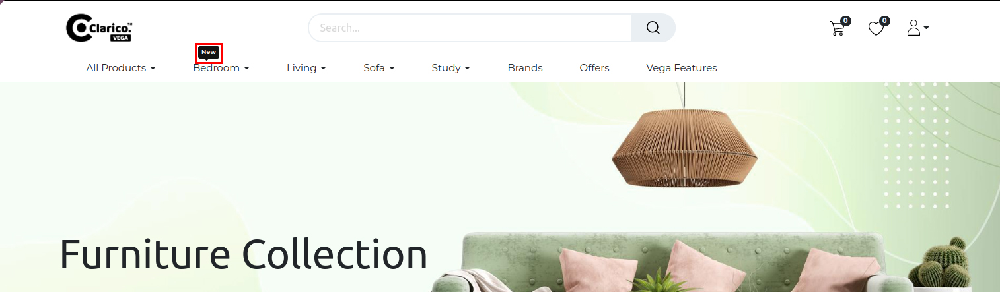

###  Dynamic Mega Menu

<figure class="video_container">
  <iframe src="https://i.ytimg.com/vi_webp/9tcrpQMkalY/sddefault.webp" > </iframe>
</figure>

With this feature, you can create a dynamic mega menu by selecting all or a specific ecommerce category from backend. There are six different styles available to apply based on the choice

Follow below steps to create a dynamic mega menu.

- **Step 1:** Go to settings and find Activate the developer mode link and click on it.
- **Step 2:** Go to a Website > Configurations > Menus > Create new
- **Step 3:** Add menu name
- **Step 4:** Check the Is Mega Menu option. After selecting this check box one option will appear as Dynamic mega menu. After selecting this option rest of the field will be enabled.

1. Category Selection: 
You can select what category you want to show in the menu as there are two options **All categories** and **Specific category**  (By default **Specific category** option is selected)

2. Select Category:  
If you have selected the Specific category in Category Selection, then only this field will appear. Now, select a specific category for that particular dynamic mega menu.

3. Mega menu Style: 
There are 6 different styles among which you can select any one as per your choice.

Once you save the menu, you can see the result on the website.

Category Menu Labels 

- Using this feature, you can display the menu label to a particular category/menu

- To enable the Menu label functionality, go to the Admin panel, **Websites>Configurations>Menu Labels.**

- **Step 1:** Create a new Menu Label 

- **Step 2:** To assign menu lable to a particular ecommerce category, Go to Configuration > ecommerce categories > select any category. You can see the **menu label** field to select from the available menu labels list.

- **Step 3:** You can create a new menu label from the eCommerce category as well by typing the name of the label and clicking on create and edit

- **Step 4:** Select the background color and text color of created menu label as per the need.

- **Step 5:** The menu label will be shown on the website for categories as below.

