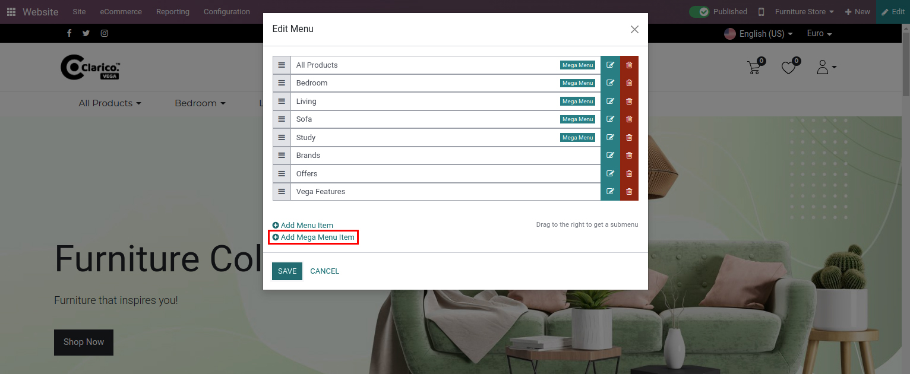
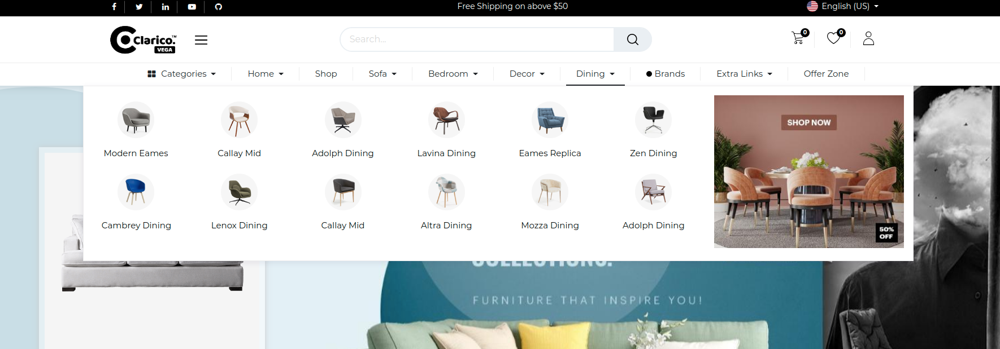

###  Mega Menu 
- To create a mega menu, go to a __Web Page / Pages / Edit Menu__  and click on __Add Mega Menu Item.__ It will show one popup to create a mega menu record.

Steps to set the mega menu style :
- **step 1:** Go to the website and click on the edit button for open Website Editor.
- **step 2:** Click on the mega menu in which you want to change the design.
- **step 3:** Check the snippets list on the left side of the web page as shown in the above screenshot. There are 6 snippets available to change the menu styles.
- **step 4:** Drag the snippet in the menu which you want to set and remove the old style that you set previously.

