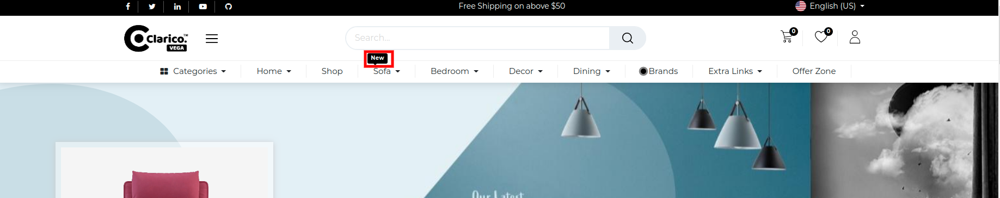

### Menu Label 

- Using this feature, you can display one label top of the menu or right side of the menu. You can add the display text for the label as well you can configure the colour of that menu label.

- To enable/disable the Menu label functionality, go to Web Pages / Customize / Customize Theme / Menu labels Text

Steps to configure Menu labels:

- **Step 1:** Go to the Pages tab and click on the edit menu option. Edit menu will pop up to select the menu.
- **Step 2:** Select the menu in which you want to apply the menu label. Click on the menu item and add a menu item popup will appear.
- **Step 3:** Enter the Menu label and Menu label text with the colour that you want to have the menu label and click on the **Save** button.

> ### TIP
> You can assign menu label and colour at the time of menu creation from the website editor panel.

