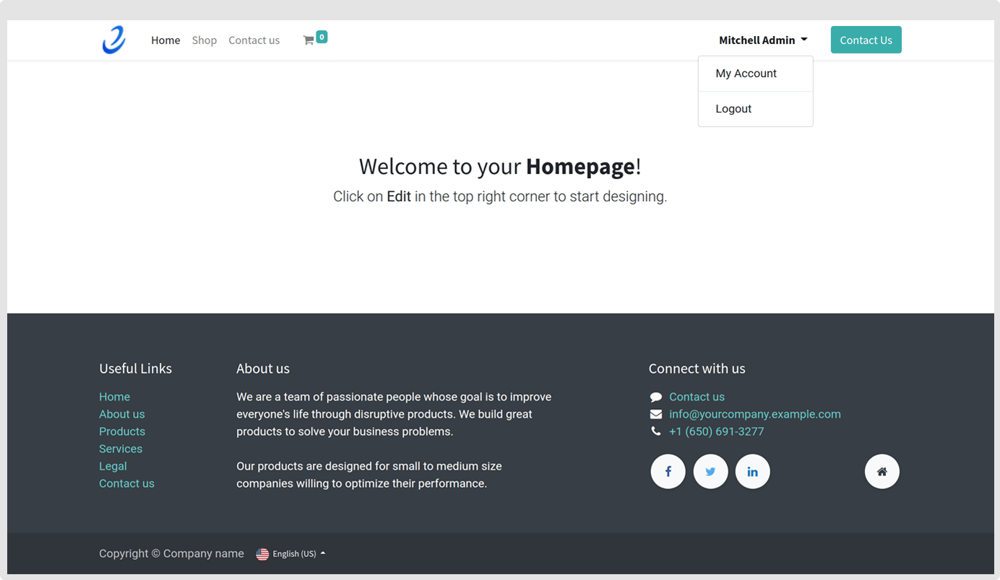
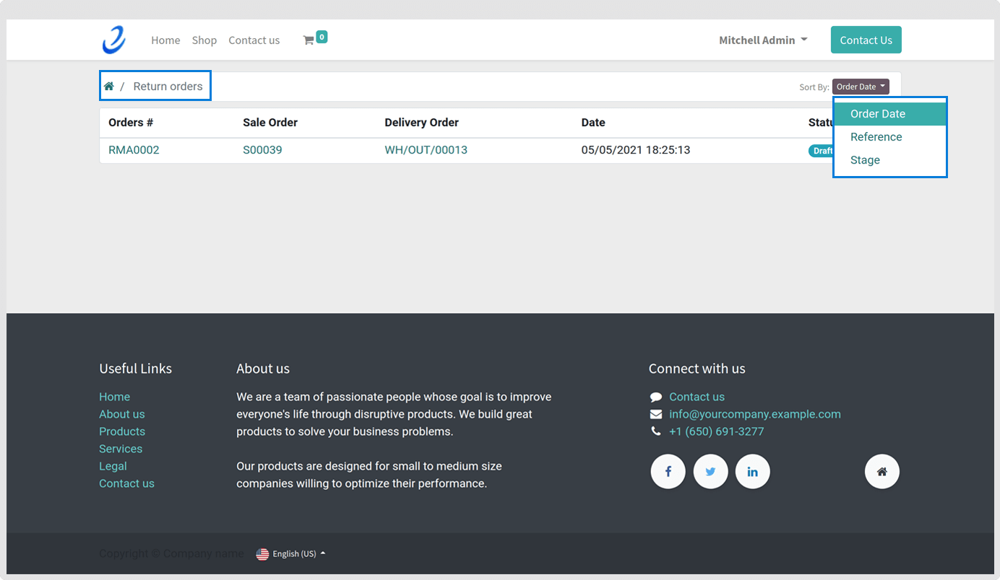
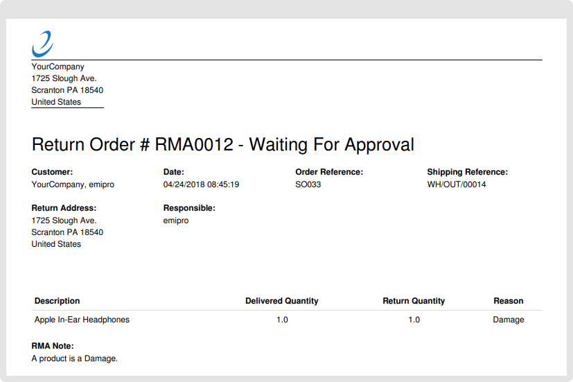

### Tracking RMA Orders in Odoo Website

To see the return request of the customer in website backend, a user needs to click on **My Account** from Username drop-down menu on the top right as shown below.

 

 

In **Your Documents** section, user will find the **RMA Orders**. Click on it and user will find all the return request made by customers on the Odoo website.

 

 

When a normal click on any RMA orders from the list, a new window will open which shows all the details of return request from a customer. Here the status of an order is ‘Waiting for Approval’ that means the further action will be taken by admin-level user.

Admin user handles the rest of the process from Odoo and a normal user gets notified once the particular order is approved.

A normal user can download the whole order as shown. Furthermore, a user can jump between orders from arrows button placed on the centre top.

Save the PDF file with complete details of RMA order by clicking on download button placed at the top right of RMA Order

 

 

 

 

